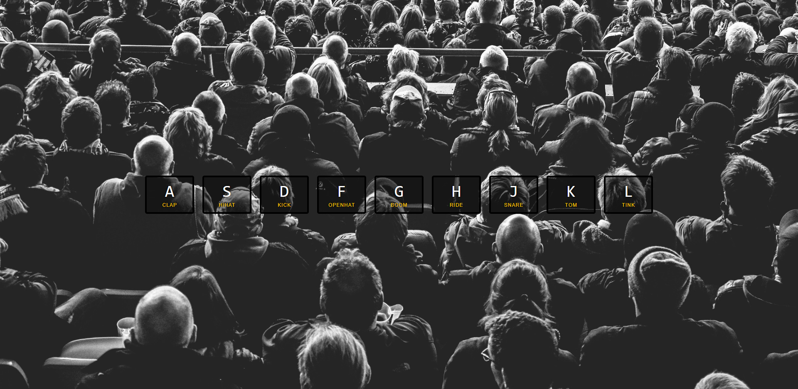

# 01-JavaScript Drum Kit

> This is a demo built up from the practice in [JavaScript 30]([https://github.com/wesbos/JavaScript30](https://github.com/wesbos/JavaScript30) without any framework




[demo](url)

Drum kit will represent the sound which relates to the key you've pressed.


## Steps

1. Display the keyboard button which be pressed.
   
   1. switch CSS style class when you press on the keyboard.

2. Hear the drum sound when the keyboard be pressed.
   
   1. `data-attribute` to hook up the `<div>` of `<kbd>` with `<audio>`.
   
   2. `addEventListener` to `window` with `keydown` event
   
   3. transition end event


## Note

### HTML

#### kbd

define the keyboard input

```html
<kbd>keyboard input</kbd>
```

> 🔗Reference:
> 
> [W3schools-kbd](https://www.w3schools.com/tags/tag_kbd.asp)
> 
> [JavaScript keycode](http://keycode.info/](http://keycode.info/)

### CSS

##### transition

change property values smoothly, over a given duration.

can use with `:hover` or `:active` make the property changes

```css
div {
	width: 100px;
	height: 100px;
	background: red;
	-webkit-transition: width 2s; /* For Safari 3.1 to 6.0 */
	transition: width 2s;
}

//
div:hover {
	width: 300px;
}
```

> 🔗Reference:
> 
> [W3schools-transition](https://www.w3schools.com/css/css3_transitions.asp)

##### text-shadow

add shadow to a text

`text-shadow: h-shadow v-shadow blur-radius color|none|initial|inherit;`

```css
text-shadow: 0 0 5px black
```

> 🔗Reference:
> 
> [W3schools-transition](https://www.w3schools.com/css/css3_transitions.asp)

##### transform

rotate, skew, and scale the `<div>` element

```css
transform: scale(1.1)
```

> 🔗Reference:
> 
> [W3school-transform](https://www.w3schools.com/cssref/css3_pr_transform.asp)


##### text-transform

uppercase, lowercase and capitalize

```css
div.a {
  text-transform: uppercase;
}

div.b {
  text-transform: lowercase;
}

div.c {
  text-transform: capitalize;
```

> 🔗Reference:
> 
> [W3school-text-transform](https://www.w3schools.com/cssref/pr_text_text-transform.asp)

##### background: rgba(255, 0, 0, 0.3)

`rgba(red, green, blue, alpha)`

```css

p {background-color: rgba(0, 0, 255, 0.3);}  /* blue with opacity */
```

> 🔗Reference:
> 
> [W3school-colors](https://www.w3schools.com/css/css3_colors.asp)


### JavaScript

##### event.keyCode

get the Unicode keycode value of the pressed keyboard key

```javascript
var x = event.keyCode;
```

##### audio.play

play the sound in `<audio>`

```javascript
audioObject.play()
```

> 🔗Reference:
> 
> [W3school-Audio play() Method](https://www.w3schools.com/jsref/met_audio_play.asp)

##### audio.currentTIme

set the time position

```javascript
audioObject.currentTime = 0
```

> 🔗Reference:
> 
> [W3school-Audio/Video.currentTime](https://www.w3schools.com/tags/av_prop_currenttime.asp)

##### Element.classList

add, remove and toggle CSS classes on an element

method: `.add`, `.remove`, `.contains`, `.item`, `.toggle`

```javascript
document.getElementById("myDIV").classList.add("mystyle");
```

> 🔗Reference:
> 
> [W3school-Audio/Video.currentTime]((https://www.w3schools.com/jsref/prop_element_classlist.asp)

##### forEach() Method

List each item in the array

`array.forEach(function(currentValue, index, arr), thisValue)`

```javascript
const fruits = ['Durian', 'Mango', 'Dragon fruit']

fruits.forEach(function(item) {
    console.log(item)
})

// Durain
// Mango
// Dragon fruit
```

> 🔗Reference:
> 
> [W3school-forEach() Method](https://www.w3schools.com/jsref/jsref_foreach.asp)

##### transitionend event

Do something with an element when a CSS transition has ended

```javascript
object.addEventListener("transitionend", function);
```

> 🔗Reference:
> 
> [W3schools-transitionend Event](https://www.w3schools.com/jsref/event_transitionend.asp)

##### event.propertyName

get the property name related to the transition

```javascript
function removeTransition(e) {
  if (e.propertyName !== 'transform') return
  console.log(e.propertyName)
}
```

> 🔗Reference:
> 
> [W3schools-TransitionEvent propertyName Property](https://www.w3schools.com/jsref/event_transition_propertyName.asp)


